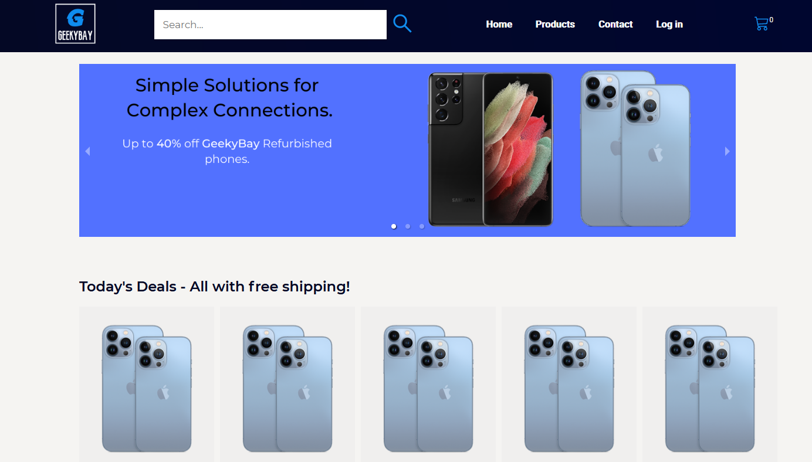

# Title: GeekyBay

- Repository: `geekybay`
- Type of Challenge: `Team`
- Duration:  `20 December 2021 - 06 January 2022`
- Deployment strategy : `Heroku`
- Contributors: 5 members:

 - [Naama](https://github.com/N-Kaplan)
 - [Xiaoqi](https://github.com/830503)
 - [Min Jie](https://github.com/minjie0501)
 - [Sofiane](https://github.com/makhouts/)
 - [Reinout](https://github.com/ReinoutDeBleser)

## Description:

Group project as part of the BeCode Web Development training. The goal is to create a webshop/minimal ebay clone where sellers may post their products for buyers to peruse and order. \
It is also our first introduction to working in an Agile environment, using Scrum.

## Requirements:

### Must Haves: 
 - [x] Minimal viable product: functional webshop where sellers can post products and buyers can place orders and buy.
 - [ ] Responsive website.
 - [ ] Secure website - to be seen.

### Nice to have:
 - [ ] Bidding

## Stack:

Front-end: React\
Back-end: Node.js, express\
Database: MySQL\
Hosting: Heroku

## Deployment:

For local deployment use the sample geekyBay.sql database provided in the project's root folder.\
Rename .env.sample to .env and insert your local database parameters and keys.\
The package-lock.json file provides the necessary modules.\
Execute the following commands in the terminal: 
 - root folder: `npm install`
 - frontend folder: `npm start`
 - backend folder: `npm run dev`

## Strategy 

The project was divided into three sprints with a duration varying between 2 and 5 days. 
### Sprint 1:
 - Front-end: Home page layout, footer, navbar, redirect page, login page, product fields.
 - Back-end: CRUD routes, database, authentication middleware
### Sprint 2:
 - Front-end: contact page, cart
 - Back-end: additions to database (order details table), protecting routes as necessary, mock emails (using ethereal) 
### Sprint 3:
 - Front-end: user dashboard, products page
 - Back-end: payment, rate limit api requests, uploading (product) images, emails
 